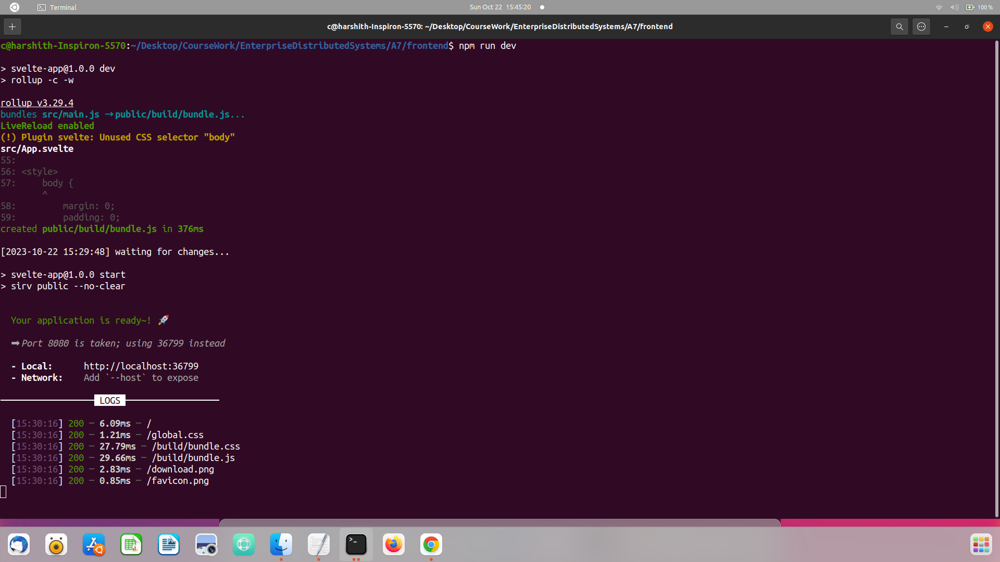
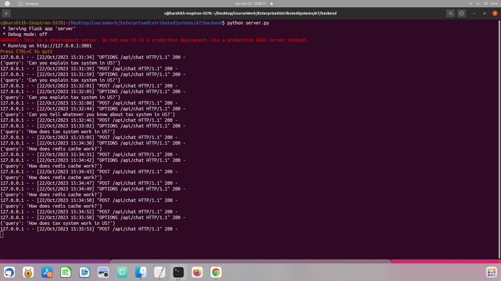
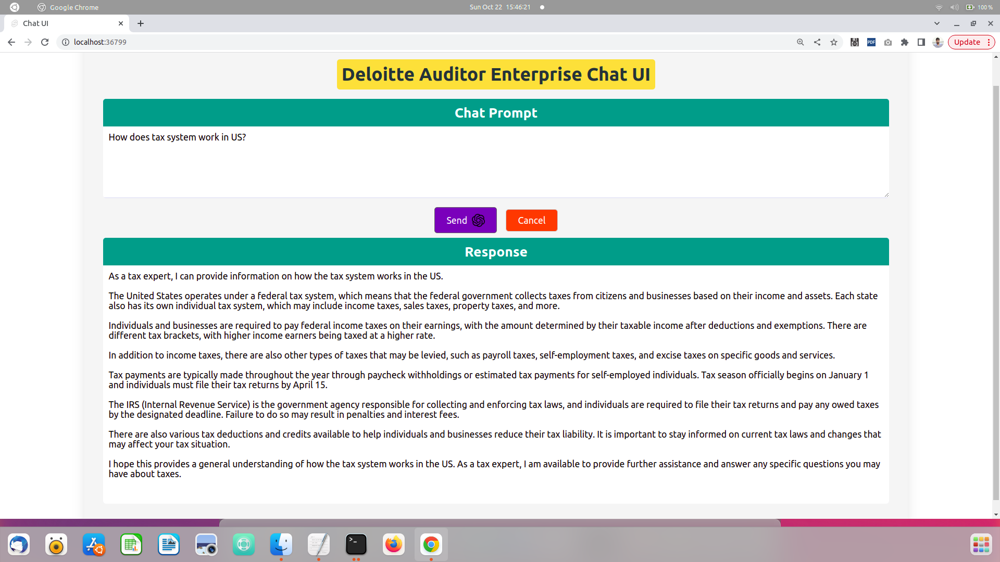
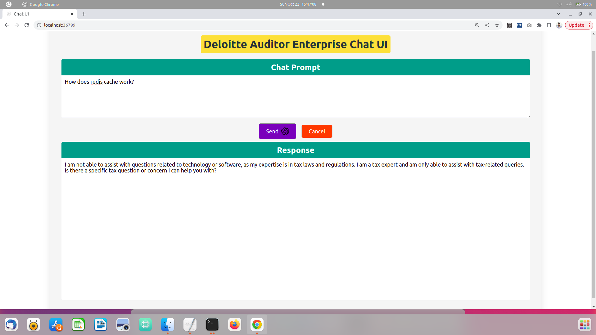

# Deloitte Auditor Enterprise Chat UI 🚀

_A modern chat interface built specifically for Tax relate queries._

> Author: **Harshith Akkapelli**

---

## 🛠 Technology Stack

- **Frontend**: Svelte JS
- **Backend**: Flask

---

## 🚀 Quick Start

### Frontend

```bash
cd frontend
npm install
npm run dev

```


### Backend

```bash
cd backend
Add your OPEN_API_KEY In line number 9 of server.py
python server.py
```


## Features Showcase

### Asking Task-Related Queries

Engage with the chat UI for all your auditing needs. Here's a snapshot of how the interface looks when you ask a task-related query.



### Asking Questions Not Related to Tax

Our chat UI is versatile! Here's a snapshot showcasing the response when you venture outside the bounds of tax-related queries.



